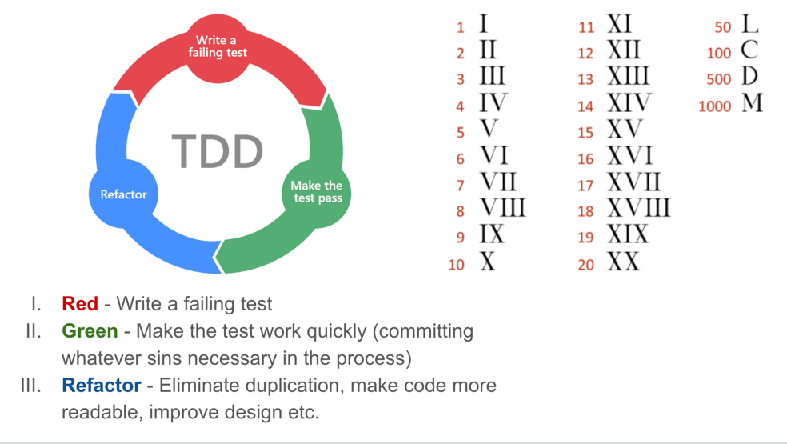

## Second problem 
1. Write a program that returns the correct string for an input from 1 to hundred.
2. Usually just return the number itself.
3. For multiples of 3 return Fizz instead of the number
4. For the multiples of five return Buzz instead of the number
5. For numbers which are multiples of both three and five return FizzBuzz instead of the number

```
1 -> 1
2 -> 2
3 -> 'Fizz'
4 -> 4
5 -> 'Buzz'
6 -> 'Fizz'
...
15 -> 'FizzBuzz'
```